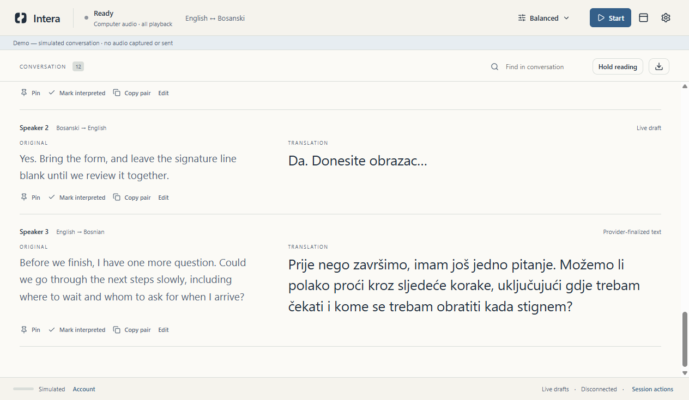
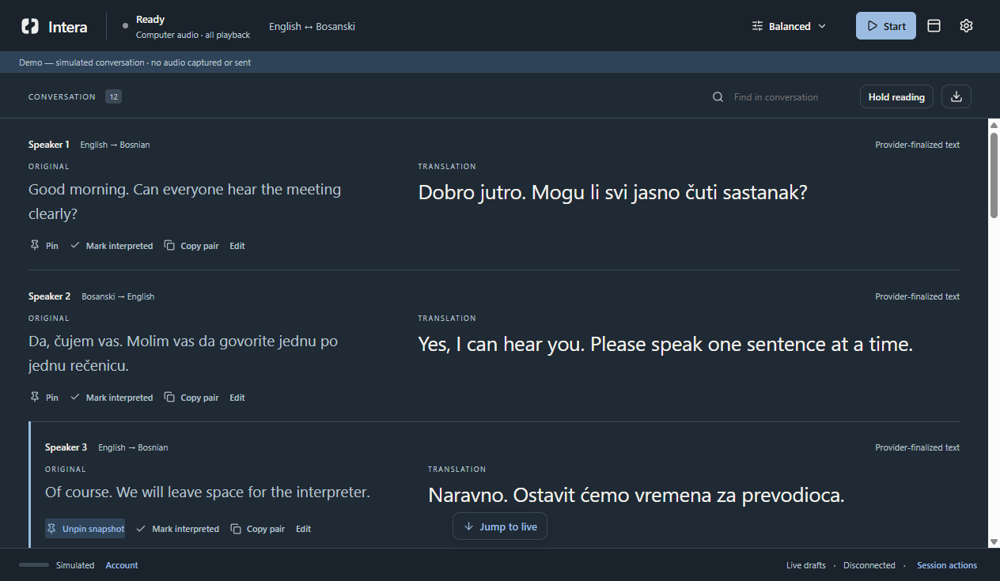
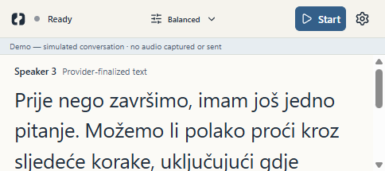

<p align="center">
  
</p>

<h1 align="center">A reading instrument for human interpreters</h1>

<p align="center">
  Live English ↔ Bosnian transcription and translation alongside the original speech.
  You stay in charge of the interpretation.
</p>

<p align="center">
  <a href="docs/SONIOX-SETUP-FOR-USERS.md">Set up Soniox</a> ·
  <a href="#try-the-demo">Try the demo</a> ·
  <a href="#what-is-verified">Beta status</a> ·
  <a href="CONTRIBUTING.md">Contribute</a>
</p>

<p align="center">
  <a href="https://github.com/Kerim-Sabic/intera/actions/workflows/build.yml"></a>
  <a href="LICENSE"></a>
</p>

> **Internal beta.** Intera is an interpreter aid, not an autonomous interpreter or a clinically validated product. The demo and local playback capture have been exercised; funded live Soniox translation and physical Mac capture still need end-to-end verification. There is no signed public release.



*Actual Electron screenshot. The conversation is simulated and labeled Demo; no meeting audio was captured or sent.*

## Why Intera?

Intera keeps the original and translated text together in one chronological reading view. It copies **computer playback** rather than joining, speaking into, or controlling a meeting. The human interpreter decides what to say.

- **Read both sides:** English ↔ Bosnian source and translation, with live drafts and finalized text clearly distinguished.
- **Stay oriented:** speaker turns, search, pinned snapshots, interpreted markers, manual corrections, and a jump-to-live control after scrolling back.
- **Adjust the pace:** Speed, Balanced, Accuracy-first, and Custom processing profiles; independent source and translation text sizes, spacing, themes, and draft visibility.
- **Keep a small view:** compact reader stays above other windows without taking focus from the meeting.
- **Control the session:** explicit Start, Pause, Stop, local playback test, and transcript export. Demo works without an account.

Intera captures all computer playback while listening, including notifications. It does not request the physical microphone in meeting-playback mode. Only share audio you are authorized to process.

## Try the demo

You need **Node.js 22.12+** and npm on **Windows 11 x64** or **macOS 14.2+**. Linux is not a release target.

```sh
git clone https://github.com/Kerim-Sabic/intera.git
cd intera
npm ci
npm run demo
```

The demo uses twelve varied synthetic turns. It requires no Soniox account, payment, key, or audio capture. For the illustrated setup of a real user-owned Soniox project, see **[Set up Intera with your own Soniox account](docs/SONIOX-SETUP-FOR-USERS.md)**. In the app, choose **Set up Intera → Pay Soniox directly**.

In that mode, the user funds their own Soniox API account and pastes a project key into Intera's masked field. Soniox bills the user for API use; Intera adds no usage fee. The key can be kept for this session or stored with the operating system's secure storage. A key check does not verify credit or live access. Existing Intera account/subscription work is separate and remains behind service readiness gates.

<details>
<summary>Dark theme and compact reader</summary>





Both screenshots are from the running Electron app with labeled synthetic content.
</details>

## How it works

```text
Meeting playback ──► local capture host ──► Intera's trusted desktop process
                                                 │
                                                 ├──► Soniox real-time API
                                                 │    (only when you start a live session)
                                                 ▼
                                  original + translation reader
```

The renderer does not receive the API key. Personal-mode audio streams directly from the desktop to the selected regional Soniox endpoint; it does not pass through Intera's billing server. Intera stores preferences and, if requested, an encrypted key on this device. It does not provide cloud transcript history. See [architecture](docs/ARCHITECTURE.md) and [direct-payment boundaries](docs/DIRECT-SONIOX.md) for the implementation details.

## What is verified

| Area | Current evidence |
| --- | --- |
| Demo, settings, onboarding, reader, compact mode | Automated Electron UI checks with synthetic conversation |
| Windows computer-playback capture | Local synthetic-tone samples arrived while minimized; Stop ended capture |
| Windows and Mac packaging | CI builds Windows x64, Apple Silicon, and Intel Mac artifacts |
| Live paid Soniox transcription and translation | **Not yet verified with a funded user account** |
| Physical Mac meeting/headset capture | **Not yet verified** |
| Public distribution | **Not ready:** builds are unsigned; signing, notarization, and release checks remain |

CI build success is evidence of packaging, not evidence that live capture works on every machine. [Compatibility and release checks](docs/COMPATIBILITY.md) and the [beta evidence report](docs/MANAGED-BETA-EVIDENCE.md) record the practical limits. No public checkout or automatic overage charging is enabled.

## Develop

```sh
npm ci
npm run dev                 # build and open the desktop app
npm run typecheck
npm run lint
npm test
npm run test:ui
npm run diagnostics:capture # local synthetic playback, no provider upload
npm run make                # unsigned packages for your current platform
```

The desktop is Electron + React + strict TypeScript. The optional managed-account server uses TypeScript, Supabase, and a separate allowance ledger; it is not needed for the demo or personal Soniox mode. Never commit keys, patient details, recordings, or real transcripts. See [CONTRIBUTING.md](CONTRIBUTING.md) for a focused first contribution.

## Project and license

Intera is a beta being built in the open. Bug reports, accessibility feedback, and reproducible platform evidence are especially useful. Feature ideas are welcome, but the next priorities are live-provider verification, physical Mac/Windows meeting tests, and signed distribution. Use the [issue templates](.github/ISSUE_TEMPLATE) for general feedback and [private reporting guidance](SECURITY.md) for security concerns.

Created by **Kerim Sabic** as a **Horalix** project. The code and original repository artwork are licensed under [Apache 2.0](LICENSE); attribution is recorded in [NOTICE](NOTICE). The license does not grant rights to use the Intera or Horalix names or marks to imply endorsement. Third-party packages keep their own licenses; no Soniox, Electron, Whop, or Apple affiliation is claimed.
