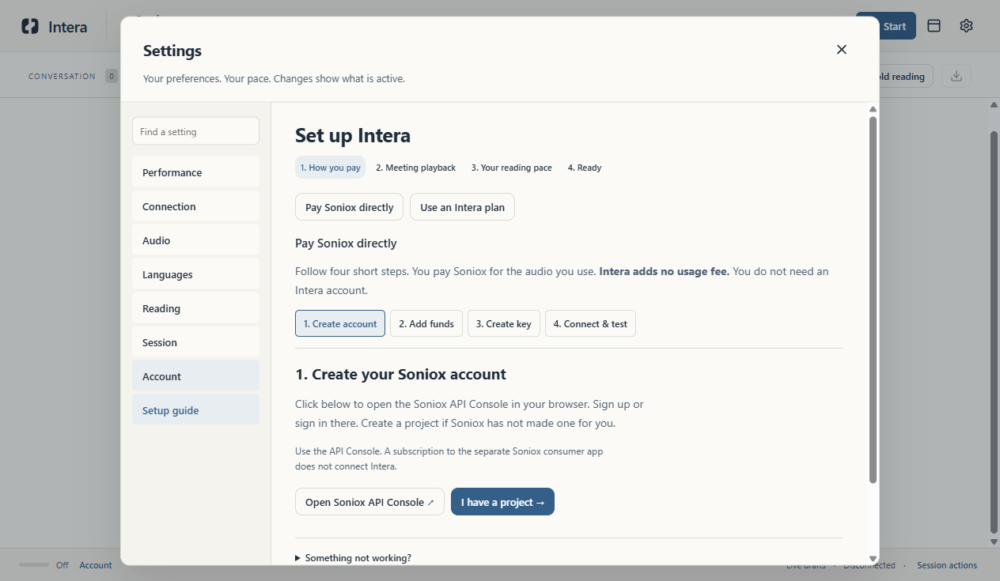
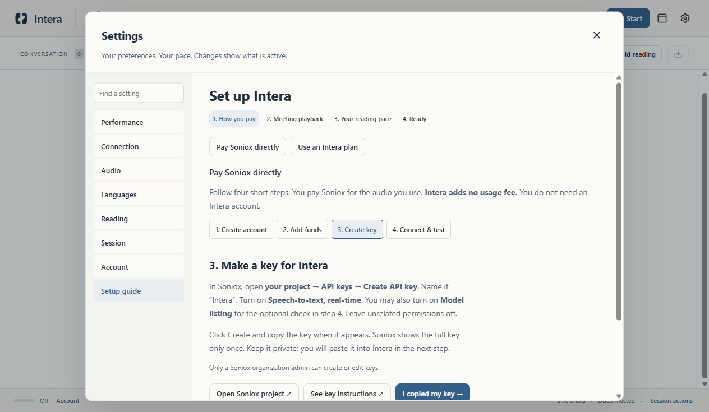
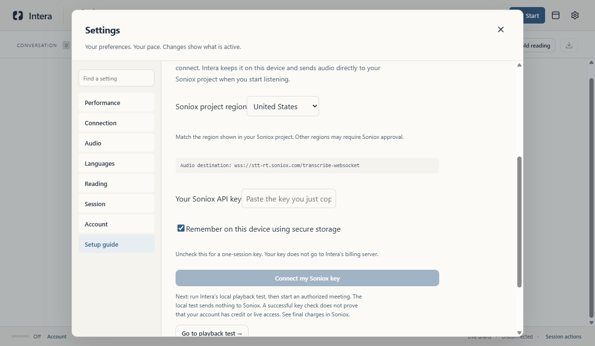

# Set up Intera with your own Soniox account

**You need:** Intera, a Soniox API account, and a payment method or credit in Soniox. Setup usually happens once. Soniox charges your account for API use; Intera adds no usage fee. You do not need an Intera sign-in for this option.

**Keep your Soniox API key private.** Paste it only into Intera's masked key box. Never send it in email, chat, or a screenshot.

## 1. Open the setup guide

In Intera, click **Set up Intera** → **Pay Soniox directly**. If you have already opened Intera, use **Settings → Setup guide** or **Settings → Account**. The guide has four buttons across the top; you can return to any step.

## 2. Create a Soniox project

Click **Open Soniox API Console**. In the browser, make a Soniox account or sign in. Open your project; Soniox may have created **My First Project** for you. If there is no project, create one. Keep this browser tab open.

Use the **API Console** at [console.soniox.com](https://console.soniox.com/). The separate Soniox consumer app subscription is not an API key for Intera.

## 3. Review billing

In the Soniox Console, open your organization's **Billing** page. Review [Soniox's current API pricing](https://soniox.com/pricing) and choose how to fund the account there. Soniox may offer credit or AutoPay. Enter card details only on Soniox's site, and decide whether to enable AutoPay yourself.

Set a budget and alert for your project if those controls are available. A Soniox limit or alert may not stop a session immediately. Intera will not buy credit or change your billing settings.

## 4. Make the API key

In the Soniox Console, open **your project → API keys → Create API key**. Name the key **Intera**. Enable **Speech-to-text, real-time**. You can also enable **Model listing** if you want Intera's optional no-audio key check. Leave the other permissions off. Only a Soniox organization admin can create or edit keys.

Click **Create**, then copy the full key while it is shown. Soniox displays it only once. If you lose it, make a replacement key; do not try to guess it. [Soniox's key permission guide](https://soniox.com/docs/guides/api-key-permissions) has the current permission names.

## 5. Connect it to Intera

In the Intera guide, click **4. Connect & test**. Choose the **same region** shown by your Soniox project, then paste your key into **Your Soniox API key**. If you are unsure about the region, check the project in Soniox before connecting. [Soniox's region guide](https://soniox.com/docs/data-residency) lists supported regions and notes that regional access may need approval.

Check **Remember on this device using secure storage** if you want the key available after restarting Intera. Uncheck it for a key that lasts only until you quit. Click **Connect my Soniox key**. The box clears after you submit; Intera never shows the saved key again.

The optional **Check key without audio** checks only the model-listing permission. Success does **not** prove that your account has credit or live transcription access.

## 6. Test audio and start

Click **Go to playback test** in the guide. Play an authorized sample through the same meeting speaker or headset you intend to use, then click **Start local playback test**. This test stays on your computer and should show that samples are arriving. Click **Stop test** when done.

Choose your reading pace, open the workspace, and click **Start**. Review the audio-sharing prompt before confirming. Intera captures a copy of computer playback, including notifications, and sends the audio to your Soniox project for English/Bosnian transcription and translation. It does not ask for your physical microphone in meeting-playback mode. Use **Pause** or **Stop** when you are done. Check the final charges in Soniox.

**If something fails:** “Key rejected” usually means the key or project region is wrong. “Permission denied” means the key needs **Speech-to-text, real-time**. A balance or budget message means you need to review Soniox Billing or limits. After fixing the issue, start a new Intera session yourself.

For help, revisit **Settings → Setup guide → Something not working?**. The [Soniox API Console](https://console.soniox.com/) is where you manage the key, billing, limits, and final usage.
